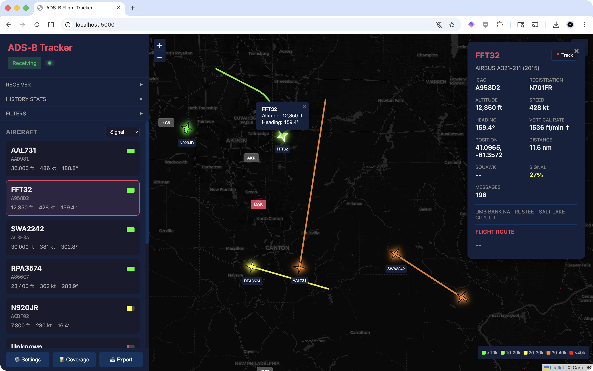
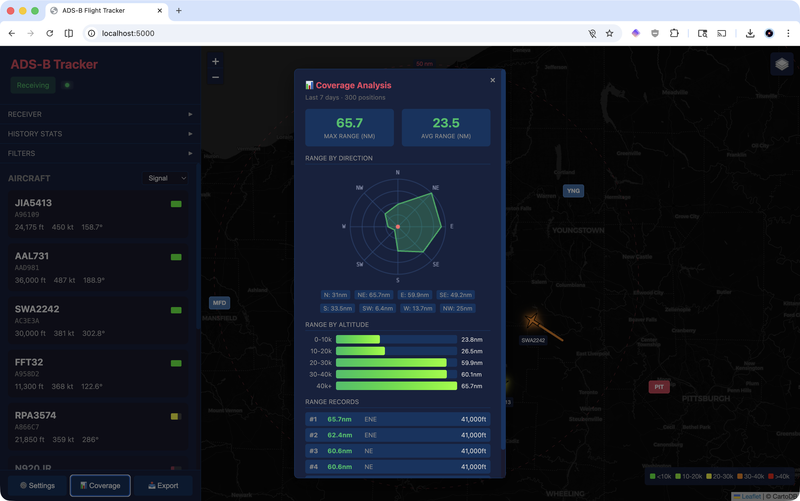
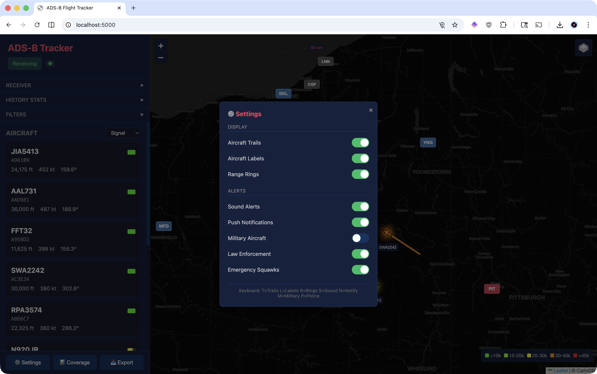

# ADS-B Flight Tracker

A real-time ADS-B (Automatic Dependent Surveillance-Broadcast) flight tracker built with Ruby and Rails. Receives 1090 MHz radio signals from aircraft using an RTL-SDR dongle and displays live flight data via a web interface or terminal UI.



## Features

- **Real-time aircraft tracking** - Decode ADS-B messages directly from radio signals
- **Web interface** - Live map and aircraft list with WebSocket updates
- **Terminal UI** - Full-featured ncurses interface for headless operation
- **Flight history** - SQLite database stores all sightings for analysis
- **FAA integration** - Aircraft registration and type lookup
- **Multiple output formats** - JSON API, SBS BaseStation, Beast binary



## Requirements

- Ruby 3.2+
- RTL-SDR compatible dongle (RTL2832U chipset)
- librtlsdr (`brew install librtlsdr` on macOS)
- libusb (`brew install libusb`)

## Installation

```bash
# Clone the repository
git clone https://github.com/joshfng/adsb.git
cd adsb

# Install dependencies
bundle install

# Set up the database
bin/rails db:prepare

# Optional: Download FAA aircraft registry (~85MB)
bin/rails faa:setup
```

## Usage

### Web Interface

```bash
bin/rails server
```

Open http://localhost:3000 to view the web interface.

### Terminal UI

```bash
bin/adsb -i
```



### Command Line Options

```
bin/adsb              Start web UI (default)
bin/adsb -i           Start interactive TUI
bin/adsb -w           Start web UI
bin/adsb -v           Verbose logging
bin/adsb -p 8080      Web UI on custom port

SDR Options (dump1090-compatible):
  --device-index <n>    Select RTL-SDR device
  --gain <db>           Set gain (default: max)
  --freq <hz>           Set frequency (default: 1090000000)
  --lat/--lon           Receiver position for distance calculation
  --max-range <nm>      Max decode range (default: 300)
  --fix/--no-fix        CRC error correction
  --show-only <icao>    Filter to single aircraft
```

## Configuration

Environment variables:

| Variable | Description | Default |
|----------|-------------|---------|
| `ADSB_DEVICE_INDEX` | RTL-SDR device index | 0 |
| `ADSB_GAIN` | Gain in dB (or empty for max) | max |
| `ADSB_LAT` | Receiver latitude | - |
| `ADSB_LON` | Receiver longitude | - |
| `ADSB_MAX_RANGE` | Max range in nautical miles | 300 |
| `ADSB_AUTO_START` | Auto-start receiver on boot | true |

## API Endpoints

| Endpoint | Description |
|----------|-------------|
| `GET /api/aircraft` | List all tracked aircraft |
| `GET /api/aircraft/:icao` | Single aircraft details |
| `GET /api/stats` | Receiver statistics |
| `GET /api/status` | System status |
| `GET /api/history/stats` | Historical statistics |
| `GET /api/feed/status` | Feed status |
| `GET /api/coverage` | Coverage map data |

## FAA Data

Download and import the FAA aircraft registry:

```bash
bin/rails faa:download  # Download latest data
bin/rails faa:seed      # Import to database
bin/rails faa:setup     # Both steps
bin/rails faa:stats     # Show import statistics
```

## Development

```bash
# Run tests
bundle exec rspec

# Run linter
bundle exec rubocop

# Start development server with auto-reload
bin/dev
```

## How It Works

1. **Signal Reception** - RTL-SDR dongle samples 1090 MHz at 2 MHz
2. **Demodulation** - Pulse position modulation decoded to bits
3. **Decoding** - ADS-B message types parsed (position, velocity, identification)
4. **CRC Validation** - 24-bit CRC with optional error correction
5. **Position Calculation** - CPR decoding for latitude/longitude
6. **Display** - Real-time updates via WebSocket or ncurses

## License

MIT
